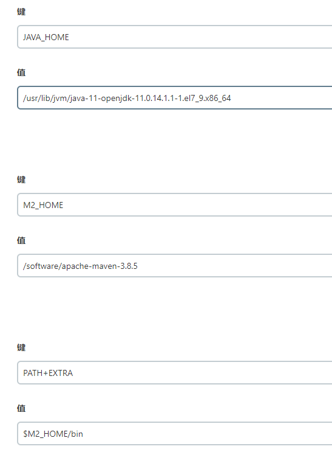
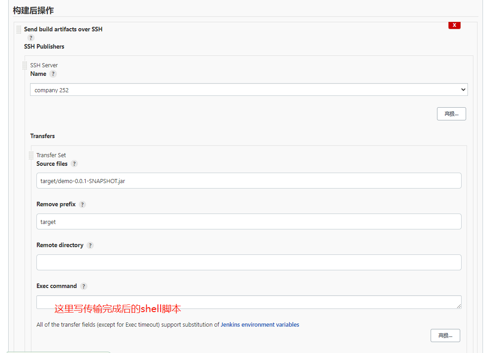

# 关于jenkins学习记录

## 1. 理论基础

### 1.1  敏捷开发模型

通过将瀑布开发模型模型中大开发周期拆分成多个小周期的开发来达到敏捷开发的目的,其核心是迭代开发和增量开发

#### 1.1 .1迭代开发

迭代开发的思路是将一个大项目拆分成多次迭代,例如先完成一个实现大体功能的小项目,然后发现问题,慢慢迭代成一个成熟的产品,侧重于通过迭代来完成目标

#### 1.1.2 增量开发

增量开发的侧重点在于按照功能拆分,将一个大模块拆分成多个小模块之后,通过逐个小模块的开发来完成,这样可以保证用户的感知度,其中的每个模块都有完整的软件开发流程(需求分析->设计->开发->测试->进化)

#### 1.1.3 个人理解 

感觉迭代开发更倾向去项目层面的多次迭代(横向拆分),增量开发倾向去按照功能的拆分(纵向拆分)

#### 1.1.4 敏捷开发模型优点

1. 早期交付,尽早部分回款
2. 降低风险,完成部分模块遇到的问题可以给其他模块借鉴解决

### 1.2 持续集成(continuous integration)


持续集成是指频繁的将代码集成的主干分支上

目的是让产品可以在保证质量的情况下让产品快速迭代

为达到以上目的,每次代码提交到主干分支之前,都会进行自动化测试,来保证代码质量

**持续集成是敏捷开发得以落实的基础**

#### 1.2.1 持续集成的流程

提交->一轮测试(自动化测试)->构建->二轮测试(对第一轮测试的补充完善,也可以把第一轮测试并到第二轮)->部署->问题回滚

#### 1.2.2 持续集成组成要素

1. 一个自动化的构建过程完成以下流程

   检出代码->编译构建->运行测试->结果记录->测试统计

2. 一个代码仓库(现在使用codeup)

3. 一个持续集成服务器(jenkins)

## 2  jenkins

持续集成服务器


鉴于实际情况,上图中gitlib对应codeup,我们也不需要tomcat,直接打成jar包即可

### 2.1 jenkins的安装(centos 环境)

所有环境均基于docker 模拟操作

**安装jdk**

1. 构建centos环境

   ` docker pull centos:7`

   `docker run -it -d -p 8888:8080 --privileged=true --name centos  centos:7 /usr/sbin/init `

2. 进入容器

   `docker exec -it centos /bin/bash`

3. 安装 jenkins

   1. 更新yum源  `yum update`

   2. `yum install wget`

   3. `yum install fontconfig java-11-openjdk` **注意 使用oracle解压的方式安装jdk会使jenkins启动报错,如果想用oracle-jdk 需要使用rpm方式安装**

   4. `wget -O /etc/yum.repos.d/jenkins.repo https://pkg.jenkins.io/redhat-stable/jenkins.repo`

   5. `rpm --import https://pkg.jenkins.io/redhat-stable/jenkins.io.key`

   6. `yum install jenkins`

   7. `vi /etc/sysconfig/jenkins`

      `JENKINS_USER="root"`

   8. `systemctl daemon-reload`  加载配置文件
   9. `systemctl start jenkins`
   10. 跳过插件安装(选择插件安装->选择无插件)
   11. 创建管理员账户

4. 安装jenkins插件

   例:汉化插件

   

   

   

5. 权限管理

   通过安装插件实现权限管理的功能

   1. 安装插件

   2. 系统管理->全局安全配置->选择 role-Based Strategy->应用保存

      

   3. 系统管理->Manage and Assign Roles->manage Roles

      根据情况添加角色,分为三种角色

      + global roles 全局角色
      + item roles 项目角色
      + node roles 节点角色

      

   4. 创建两个用户

      

   5. 分配权限

      

   6. 创建两个任务

   7. 结果

      

6. 凭证管理

   1. 安装插件 Credentials Binding

   2. 安装插件 git

   3. 所在的docker容器中安装git   `yum install git`

   4. 添加凭证

      系统管理->凭证管理->点击域(全局)添加凭证

      

   5. 随便创建一个项目,

      点击配置->源码管理->选择git->设置ssh的url->选择刚才创建的凭证

   6. 在工程中点击构建后有如下日志

      

      说明项目构建成功,项目目录在`/var/lib/jenkins/workspace`下

7. maven构建

   1. 容器中安装maven

      `mkdir /software`

      `cd /software `

      `wget https://mirrors.tuna.tsinghua.edu.cn/apache/maven/maven-3/3.8.5/binaries/apache-maven-3.8.5-bin.tar.gz`

      `tar -zxvf apache-maven-3.8.5-bin.tar.gz`

      //这里可以配置一下自己的setting文件

      在 etc/profile 中配置

      `export PATH=$PATH:/software/apache-maven-3.8.5/bin`

      ` source /etc/profile`

      

   2. 配置全局变量

      系统管理->系统配置->全局属性->环境变量

      

      ```
      JAVA_HOME
      /usr/lib/jvm/java-11-openjdk-11.0.14.1.1-1.el7_9.x86_64
      M2_HOME
      /software/apache-maven-3.8.5
      PATH+EXTRA
      $M2_HOME/bin
      ```

      

   3. 打开要构建的项目->配置->构建->执行shell

      `mvn clean package`

      构建之后可以看到maven正常执行

      

      完成后去项目下面的target目录可以看到构建完成之后的文件

### 2.2 jenkins的使用

#### 2.2.1 jenkins支持的项目类型

jenkins中**常用**的构建类型有以下三种

+ 自由风格软件项目(FreeStyle Project)
+ Maven项目(Maven Project)
+ 流水线项目(Pipeline Project)

在之前的操作中 我们就使用了自由风格的软件项目,下面说明一下Mave项目和 **流水线项目**

个人认为其实自由风格和maven项目差距不大,都能完成基础的发布

**流水线项目则较难上手,但是灵活度极高**

#### 2.2.2 Maven项目

1. 安装插件 `Maven Integration`

   新建任务的时候选择maven项目

   build中的goals and options中输入

   `clean package -U -Dmaven.test.skip=true`

   其中-U 是强制更新jar包

2. 全局工具配置

   系统管理->全局工具配置->maven

   

   ```
   maven 3.8.5
   /software/apache-maven-3.8.5
   ```

   (同上)系统管理->全局工具配置->jdk

   ```
   jdk11
   /usr/lib/jvm/java-11-openjdk-11.0.14.1.1-1.el7_9.x86_64
   ```

   注:可能会提示**不是 JDK 目录** 忽略即可

   

3. 安装插件 `Publish Over SSH`

   在系统管理->系统配置->public over ssh中配置需要发送的服务器配置

   

4. 在项目的配置中添加构建后操作

   

   以上步骤可以将maven项目推送到指定服务器目录下并执行

#### 2.2.3 pipeline项目

pipeline以代码的形式实现,使团队可以编辑,审查,迭代其流程,并且极大提高了 部署流程的灵活性

##### 2.2.3.1 然后创建pipeline

1. pipe脚本由groovy语言实现
2. pipeline支持两种语法:declarative(声明式)和scripted pipeline(脚本式)
3. pipeline有两种创建方式
   + 在jenkins web页面中输入脚本
   + 通过项目中的jenkinsfile文件控制

##### 2.2.3.2 pipeline 示例

1. 安装pipeline插件

2. 创建一个pipeline(流水线)任务

3. 创建完成后发现配置多了一个流水线

   

4. pipeline的两种语法示例

   这两种方式能完成的效果是一样的,相对来说声明式更加常用

   

5. pipeline 语法片段生成器

   流水线下面有个**流水线语法**的链接,点击进入pipeline语法片段生成器,可以从这里看到语法的教程和说明

   声明式语法大体分为

   声明:上图中 agent部分

   所有阶段: stages

   单个阶段: stage

   步骤: steps (我们实际的操作写在这里边)

   逻辑很简单 ,以之前的项目为例,我们可以分为3个阶段

   + 阶段1:从git拉取代码
   + 阶段2:mave 打包
   + 阶段3:发送到目标服务器,并且执行

6. 从git拉取代码

   在片段生成器中找到 checkout 将值填好就可以生成拉取的阶段代码

   

   生成的结果如下

   ```groovy
   checkout([$class: 'GitSCM', branches: [[name: '*/master']], extensions: [], userRemoteConfigs: [[credentialsId: 'github', url: 'git@github.com:hgsxxx/xxxdemo.git']]])
   ```

   将结果放到steps里即可,结果如下

   ```groovy
   pipeline {
       agent any
       stages {
           stage('git pull') {
               steps {
                  checkout([$class: 'GitSCM', branches: [[name: '*/master']], extensions: [], userRemoteConfigs: [[credentialsId: 'github', url: 'git@github.com:hgsxxx/xxxdemo.git']]])
               }
           }
       }
   }
   ```

7. 打包项目 

   打包项目通过shell script实现

   

8. 发布项目

   

9. 完成后的pipeline脚本为

   ```groovy
   pipeline {
       agent any
   
       stages {
           stage('git pull') {
               steps {
                  checkout([$class: 'GitSCM', branches: [[name: '*/master']], extensions: [], userRemoteConfigs: [[credentialsId: 'github', url: 'git@github.com:xxxx/xxxx.git']]])
               }
           }
           stage('mvn package') {
               steps {
                  sh 'mvn -Dmaven.test.failure.ignore=true clean package'
               }
           }
           stage('ssh publish') {
               steps {
                  sshPublisher(publishers: [sshPublisherDesc(configName: 'xxxx', transfers: [sshTransfer(cleanRemote: false, excludes: '', execCommand: './jenkinstest/restart.sh', execTimeout: 120000, flatten: false, makeEmptyDirs: false, noDefaultExcludes: false, patternSeparator: '[, ]+', remoteDirectory: '', remoteDirectorySDF: false, removePrefix: 'target', sourceFiles: 'target/demo-0.0.1-SNAPSHOT.jar')], usePromotionTimestamp: false, useWorkspaceInPromotion: false, verbose: false)])
               }
           }
           
       }
   }
   ```

10. 点击立刻构建之后  成功打印日志 示例完成

    可以在流水线步骤中查看各个阶段的时间

    


