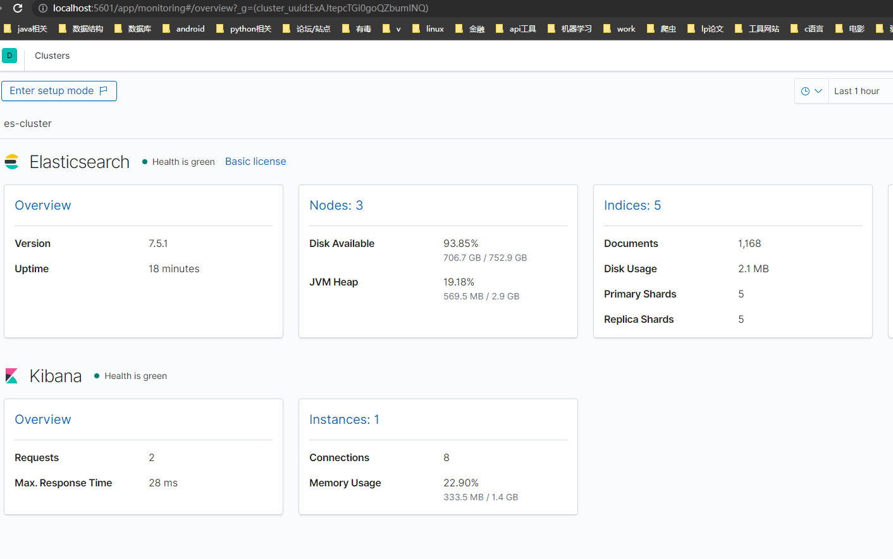

# 基于elk的简易日志系统

## 1. 安装软件环境  elasticsearch/logstash/kibana/构建使用logback的springboot项目

注:本教程基于7.5.1版本elk务必保证elk之间版本一致

### 1.1 安装elasticsearch

1. 安装镜像

   `docker pull docker.elastic.co/elasticsearch/elasticsearch:7.5.1`

2. 单节点模式启动容器

   `docker run -it --name es -d  -p 127.0.0.1:9200:9200 -p 127.0.0.1:9300:9300 -e "discovery.type=single-node" docker.elastic.co/elasticsearch/elasticsearch:7.5.1`

3. 成功后访问 localhost:9200

   

   

### 1.2使用安装logstash

本文基于docker方式安装logstash，其他方式可以参考[官网教程](https://www.elastic.co/guide/en/logstash/7.5/installing-logstash.html)

1. 安装logstash镜像

   `docker pull docker.elastic.co/logstash/logstash:7.5.1`

2. 启动logstash

   `docker run -it --name logstash --link es:es -p 127.0.0.1:4567:4567 -d docker.elastic.co/logstash/logstash:7.5.1`

3. 设置配置文件

   进入容器

   `docker exec -it logstash /bin/bash`

   进入目录

   `/usr/share/logstash/config`

   修改配置文件

   `vi vi logstash.yml`

   将es地址改为

   `xpack.monitoring.elasticsearch.hosts: [ "http://es:9200" ]`

   修改 目录 /usr/share/logstash/pipeline/logstash.conf中配置文件

   ```json
   input {
           tcp {
                   mode => "server"
                   port => 4567
       		   codec => "json"
           }
   }
   filter {
   }
   output {
           elasticsearch {
                   action => "index"
                   hosts => "es:9200"
                   index => "test_log"
           }
   }
   ```

   

4. 退出容器

   `exit`

   后 重启容器

   `docker restart logstash`

### 1.3 安装kibana

1. 下载kibana镜像

   `docker pull docker.elastic.co/kibana/kibana:7.5.1`

2. 启动kibana容器

   `docker run -it --name kibana --link es:es --link logstash:logstash -p 5601:5601 -d docker.elastic.co/kibana/kibana:7.5.1`

3. 修改配置文件

   `docker exec -it kibana /bin/bash`

   将配置文件config/kibana.yml中es地址修改为

   `elasticsearch.hosts: [ "http://es:9200" ]`

4. 重启容器

   `exit`

   `docker restart kibana`

5. 访问localhost:5601

   

### 1.4 springboot整合 logback和logstash


1. pom文件添加

   ```xml
   <dependency>
       <groupId>net.logstash.logback</groupId>
       <artifactId>logstash-logback-encoder</artifactId>
       <version>7.0</version>
   </dependency>
   ```

2. 配置文件中添加

   ```yml
   logging:
     config: src/main/resources/logback-spring.xml
   ```

3. 在相应位置创建文件logback-spring.xml  主要是name=logstash 的appender配置

   ```xml
   <?xml version="1.0" encoding="UTF-8" ?>
   <configuration>
   
   
       <!-- 彩色日志配置 -->
       <!-- 彩色日志依赖的渲染类 -->
       <conversionRule conversionWord="clr" converterClass="org.springframework.boot.logging.logback.ColorConverter" />
       <conversionRule conversionWord="wex" converterClass="org.springframework.boot.logging.logback.WhitespaceThrowableProxyConverter" />
       <conversionRule conversionWord="wEx" converterClass="org.springframework.boot.logging.logback.ExtendedWhitespaceThrowableProxyConverter" />
       <!-- 彩色日志格式 -->
       <property name="CONSOLE_LOG_PATTERN" value="${CONSOLE_LOG_PATTERN:-%clr(%d{yyyy-MM-dd HH:mm:ss.SSS}){green} %clr([${PID:-}]){magenta} %clr([%25.25t]){yellow} %clr([${LOG_LEVEL_PATTERN:-%5p ]}){red} %clr(%-40.40logger{39}){blue} %clr(:){cyan} %m%n${LOG_EXCEPTION_CONVERSION_WORD:-%wEx}}" />
   
       <appender name="consoleLog" class="ch.qos.logback.core.ConsoleAppender">
           <layout class="ch.qos.logback.classic.PatternLayout">
               <pattern>
                   <!--%d{yyyy-MM-dd HH:mm:ss.SSS} [%thread]  %-5level %logger{50} - %msg%n-->
                   ${CONSOLE_LOG_PATTERN}
               </pattern>
           </layout>
       </appender>
   
       <appender name="fileInfoLog" class="ch.qos.logback.core.rolling.RollingFileAppender">
           <filter class="ch.qos.logback.classic.filter.LevelFilter">
               <level>INFO</level>
               <onMatch>DENY</onMatch>
               <onMismatch>ACCEPT</onMismatch>
           </filter>
           <encoder>
               <pattern>
                   %d{yyyy-MM-dd HH:mm:ss.SSS} [%thread]  %-5level %logger{50} - %msg%n
               </pattern>
           </encoder>
           <!--滚动策略-->
           <rollingPolicy class="ch.qos.logback.core.rolling.TimeBasedRollingPolicy">
               <!--路径-->
               <fileNamePattern>D:/data_server/mylog/info_%d.log</fileNamePattern>
           </rollingPolicy>
       </appender>
   
   
       <appender name="fileErrorLog" class="ch.qos.logback.core.rolling.RollingFileAppender">
           <filter class="ch.qos.logback.classic.filter.ThresholdFilter">
               <level>ERROR</level>
           </filter>
           <encoder>
               <pattern>
                   %d{yyyy-MM-dd HH:mm:ss.SSS} [%thread]  %-5level %logger{50} - %msg%n
               </pattern>
           </encoder>
           <!--滚动策略-->
           <rollingPolicy class="ch.qos.logback.core.rolling.TimeBasedRollingPolicy">
               <!--路径-->
               <fileNamePattern>D:/data_server/mylog/error_%d.log</fileNamePattern>
           </rollingPolicy>
       </appender>
   
       <appender name="fileDebugLog" class="ch.qos.logback.core.rolling.RollingFileAppender">
           <filter class="ch.qos.logback.classic.filter.ThresholdFilter">
               <level>DEBUG</level>
           </filter>
           <encoder>
               <pattern>
                   %d{yyyy-MM-dd HH:mm:ss.SSS} [%thread]  %-5level %logger{50} - %msg%n
               </pattern>
           </encoder>
           <!--滚动策略-->
           <rollingPolicy class="ch.qos.logback.core.rolling.TimeBasedRollingPolicy">
               <!--路径-->
               <fileNamePattern>D:/data_server/mylog/debug_%d.log</fileNamePattern>
           </rollingPolicy>
       </appender>
       <appender name="logstash" class="net.logstash.logback.appender.LogstashTcpSocketAppender">
           <destination>127.0.0.1:4567</destination>
           <encoder charset="UTF-8" class="net.logstash.logback.encoder.LogstashEncoder"></encoder>
       </appender>
   
       <root level="INFO">
          <!-- <appender-ref ref="fileInfoLog" />
           <appender-ref ref="fileErrorLog" />
           <appender-ref ref="fileDebugLog" />-->
           <appender-ref ref="consoleLog" />
           <appender-ref ref="logstash" />
       </root>
   </configuration>
   ```

   

### 1.4 测试

运行后可以在kibana中看到相应的日志

.jpg)

### 1.5  基于FileBeat的日志收集系统

以上环境下 加上FileBeat 通过文件读取日志


## 2. 进阶

进阶中将会实现 es集群,利用filebeat从文件中读取日志,日志的冷热分离,es账号权限等问题,以满足项目部署中实际需求

### 2.1  es组建集群

基于docker-compose 启动es集群

1. 在一个空文件夹创建一个 docker-compose.yml文件  将以下内容复制进去 

   ```yml
   version: "3.6"
   # 给es集群配置一个网络，网络名为esnet
   networks:
     esnet:
       name: esnet
   services:
     es01:
       image: docker.elastic.co/elasticsearch/elasticsearch:7.5.1
       deploy: 
         resources: 
           limits:
             #cpus: '0.25' 
             memory: 4G
           reservations:
             #cpus: '0.2' 
             memory: 2G
       hostname: esnet01
       ports:
         - 9201:9200
       expose:
         - 9300
       environment:
         - node.name=es01
         - cluster.name=es-cluster
         - cluster.initial_master_nodes=es01,es02,es03
         - discovery.seed_hosts=esnet02,esnet03
         - bootstrap.memory_lock=true   
         - "ES_JAVA_OPTS=-Xms1024m -Xmx1024m"
       ulimits:
         memlock:
           soft: -1
           hard: -1
       networks:
         - esnet
     es02:
       image: docker.elastic.co/elasticsearch/elasticsearch:7.5.1
       deploy: 
         resources: 
           limits:
             #cpus: '0.25' 
             memory: 4G
           reservations:
             #cpus: '0.2' 
             memory: 2G
       depends_on: 
         - es01
       hostname: esnet02
       ports:
         - 9202:9200
       expose:
         - 9300
       environment:
         - node.name=es02
         - cluster.name=es-cluster
         - cluster.initial_master_nodes=es01,es02,es03
         - discovery.seed_hosts=esnet01,esnet03
         - bootstrap.memory_lock=true   
         - "ES_JAVA_OPTS=-Xms1024m -Xmx1024m"
       ulimits:
         memlock:
           soft: -1
           hard: -1
       networks:
         - esnet
     es03:
       image: docker.elastic.co/elasticsearch/elasticsearch:7.5.1
       deploy: 
         resources: 
           limits:
             #cpus: '0.25' 
             memory: 4G
           reservations:
             #cpus: '0.2' 
             memory: 2G
       depends_on: 
         - es02
       expose:
         - 9300
       hostname: esnet03
       ports:
         - 9203:9200
       environment:
         - node.name=es03
         - cluster.name=es-cluster
         - cluster.initial_master_nodes=es01,es02,es03
         - discovery.seed_hosts=esnet01,esnet02
         - bootstrap.memory_lock=true   
         - "ES_JAVA_OPTS=-Xms1024m -Xmx1024m"
       ulimits:
         memlock:
           soft: -1
           hard: -1
       networks:
         - esnet
     kibana:
       depends_on: 
         - es01
         - es02
         - es03
       image: docker.elastic.co/kibana/kibana:7.5.1
       ports:
         - 5601:5601
       environment:
         - SERVERNAME=kibana
         - ELASTICSEARCH_HOSTS=http://esnet01:9200
         - ELASTICSEARCH_USERNAME=kibana_system
       networks:
         - esnet
   ```

2. 后在文件夹内打开powershell执行

   `docker-compose up -d`

3. 启动完成后 访问 localhost:5601 即可访问kibana

   

### 2.1.1 启动中可能遇到的问题

1.  exited with code 78

   我是基于wsl2引擎启动集群的时候碰到了这个问题,向上查找发现如下报错

   `max virtual memory areas vm.max_map_count [65530] is too low, increase to at least [262144]`

   解决方案为:

   在本机powershell中运行以下命令进入linux环境

    `wsl -d docker-desktop`

   在linux环境中执行

   `sysctl -w vm.max_map_count=262144`

   `exit`

   然后重启集群即可

2.  exited with status 137

   内存不足,可以尝试修改docker-compose中的

   `memory: 4G/2G` 

   `"ES_JAVA_OPTS=-Xms1024m -Xmx1024m"` 

   这些配置来降低占用的资源,如果还不行的话可以尝试切换到wsl2引擎启动docker试试(默认是hyper5引擎),再不行增加虚拟内存,还不行没救了

### 2.2 启动logstash容器

`docker pull docker.elastic.co/logstash/logstash:7.5.1`

```json
input {
    beats {
        port => "5044"
    }
}
output {
    stdout { codec => rubydebug }
    
    if "errorlog" in [tags] {
		elasticsearch {
			hosts => ["es01:9200"]
			index => "errorlog"
			document_type => "log"
		}
	}
    if "infolog" in [tags]{
        elasticsearch {
			hosts => ["es01:9200"]
			index => "infolog"
			document_type => "log"
		}
    }
}
```


`docker run --rm -it -d --name logstash --network esnet -p 5045:5044 -v I:\workspace\projects\elkdemo\logstash\dockerlogstash\first-pipeline.conf:/usr/share/logstash/pipeline/logstash.conf docker.elastic.co/logstash/logstash:7.5.1`

### 2.3 启动filebeat

配置filebeat.yml文件

```yml
###################### Filebeat Configuration Example #########################

# This file is an example configuration file highlighting only the most common
# options. The filebeat.reference.yml file from the same directory contains all the
# supported options with more comments. You can use it as a reference.
#
# You can find the full configuration reference here:
# https://www.elastic.co/guide/en/beats/filebeat/index.html

# For more available modules and options, please see the filebeat.reference.yml sample
# configuration file.

#=========================== Filebeat inputs =============================
filebeat.inputs:
  - type: log
    enabled: true
    paths:
      - I:\workspace\projects\elkdemo\mylog\info*.log
    tags: ["infolog"]
  - type: log
    enabled: true
    paths:
      - I:\workspace\projects\elkdemo\mylog\error*.log
    tags: ["errorlog"]
#filebeat.inputs:

# Each - is an input. Most options can be set at the input level, so
# you can use different inputs for various configurations.
# Below are the input specific configurations.

#- type: log

  # Change to true to enable this input configuration.
  #enabled: true

  # Paths that should be crawled and fetched. Glob based paths.
  #paths:
    #- /var/log/*.log
    #- c:\programdata\elasticsearch\logs\*
    #- I:\workspace\projects\elkdemo\mylog\*.log
  # Exclude lines. A list of regular expressions to match. It drops the lines that are
  # matching any regular expression from the list.
  #exclude_lines: ['^DBG']

  # Include lines. A list of regular expressions to match. It exports the lines that are
  # matching any regular expression from the list.
  #include_lines: ['^ERR', '^WARN']

  # Exclude files. A list of regular expressions to match. Filebeat drops the files that
  # are matching any regular expression from the list. By default, no files are dropped.
  #exclude_files: ['.gz$']

  # Optional additional fields. These fields can be freely picked
  # to add additional information to the crawled log files for filtering
  #fields:
  #  level: debug
  #  review: 1

  ### Multiline options

  # Multiline can be used for log messages spanning multiple lines. This is common
  # for Java Stack Traces or C-Line Continuation

  # The regexp Pattern that has to be matched. The example pattern matches all lines starting with [
  #multiline.pattern: ^\[

  # Defines if the pattern set under pattern should be negated or not. Default is false.
  #multiline.negate: false

  # Match can be set to "after" or "before". It is used to define if lines should be append to a pattern
  # that was (not) matched before or after or as long as a pattern is not matched based on negate.
  # Note: After is the equivalent to previous and before is the equivalent to to next in Logstash
  #multiline.match: after


#============================= Filebeat modules ===============================

filebeat.config.modules:
  # Glob pattern for configuration loading
  path: ${path.config}/modules.d/*.yml

  # Set to true to enable config reloading
  reload.enabled: false

  # Period on which files under path should be checked for changes
  #reload.period: 10s

#==================== Elasticsearch template setting ==========================

setup.template.settings:
  index.number_of_shards: 1
  #index.codec: best_compression
  #_source.enabled: false

#================================ General =====================================

# The name of the shipper that publishes the network data. It can be used to group
# all the transactions sent by a single shipper in the web interface.
#name:

# The tags of the shipper are included in their own field with each
# transaction published.
#tags: ["service-X", "web-tier"]

# Optional fields that you can specify to add additional information to the
# output.
#fields:
#  env: staging


#============================== Dashboards =====================================
# These settings control loading the sample dashboards to the Kibana index. Loading
# the dashboards is disabled by default and can be enabled either by setting the
# options here or by using the `setup` command.
#setup.dashboards.enabled: false

# The URL from where to download the dashboards archive. By default this URL
# has a value which is computed based on the Beat name and version. For released
# versions, this URL points to the dashboard archive on the artifacts.elastic.co
# website.
#setup.dashboards.url:

#============================== Kibana =====================================

# Starting with Beats version 6.0.0, the dashboards are loaded via the Kibana API.
# This requires a Kibana endpoint configuration.
setup.kibana:

  # Kibana Host
  # Scheme and port can be left out and will be set to the default (http and 5601)
  # In case you specify and additional path, the scheme is required: http://localhost:5601/path
  # IPv6 addresses should always be defined as: https://[2001:db8::1]:5601
  #host: "localhost:5601"

  # Kibana Space ID
  # ID of the Kibana Space into which the dashboards should be loaded. By default,
  # the Default Space will be used.
  #space.id:

#============================= Elastic Cloud ==================================

# These settings simplify using Filebeat with the Elastic Cloud (https://cloud.elastic.co/).

# The cloud.id setting overwrites the `output.elasticsearch.hosts` and
# `setup.kibana.host` options.
# You can find the `cloud.id` in the Elastic Cloud web UI.
#cloud.id:

# The cloud.auth setting overwrites the `output.elasticsearch.username` and
# `output.elasticsearch.password` settings. The format is `<user>:<pass>`.
#cloud.auth:

#================================ Outputs =====================================

# Configure what output to use when sending the data collected by the beat.

#-------------------------- Elasticsearch output ------------------------------
#output.elasticsearch:
  # Array of hosts to connect to.
  #hosts: ["localhost:9200"]

  # Optional protocol and basic auth credentials.
  #protocol: "https"
  #username: "elastic"
  #password: "changeme"

#----------------------------- Logstash output --------------------------------
output.logstash:
  # The Logstash hosts
  hosts: ["localhost:5045"]

  # Optional SSL. By default is off.
  # List of root certificates for HTTPS server verifications
  #ssl.certificate_authorities: ["/etc/pki/root/ca.pem"]

  # Certificate for SSL client authentication
  #ssl.certificate: "/etc/pki/client/cert.pem"

  # Client Certificate Key
  #ssl.key: "/etc/pki/client/cert.key"

#================================ Processors =====================================

# Configure processors to enhance or manipulate events generated by the beat.

processors:
  - add_host_metadata: ~
  - add_cloud_metadata: ~
  - add_docker_metadata: ~
  - add_kubernetes_metadata: ~

#================================ Logging =====================================

# Sets log level. The default log level is info.
# Available log levels are: error, warning, info, debug
#logging.level: debug

# At debug level, you can selectively enable logging only for some components.
# To enable all selectors use ["*"]. Examples of other selectors are "beat",
# "publish", "service".
#logging.selectors: ["*"]

#============================== X-Pack Monitoring ===============================
# filebeat can export internal metrics to a central Elasticsearch monitoring
# cluster.  This requires xpack monitoring to be enabled in Elasticsearch.  The
# reporting is disabled by default.

# Set to true to enable the monitoring reporter.
#monitoring.enabled: false

# Sets the UUID of the Elasticsearch cluster under which monitoring data for this
# Filebeat instance will appear in the Stack Monitoring UI. If output.elasticsearch
# is enabled, the UUID is derived from the Elasticsearch cluster referenced by output.elasticsearch.
#monitoring.cluster_uuid:

# Uncomment to send the metrics to Elasticsearch. Most settings from the
# Elasticsearch output are accepted here as well.
# Note that the settings should point to your Elasticsearch *monitoring* cluster.
# Any setting that is not set is automatically inherited from the Elasticsearch
# output configuration, so if you have the Elasticsearch output configured such
# that it is pointing to your Elasticsearch monitoring cluster, you can simply
# uncomment the following line.
#monitoring.elasticsearch:

#================================= Migration ==================================

# This allows to enable 6.7 migration aliases
#migration.6_to_7.enabled: true

```


 .\filebeat.exe -e -c ..\newfilebeat\filebeat.yml -d "publish"

` docker run -it --name logstash -d  docker.elastic.co/logstash/logstash:7.5.1`

`docker pull docker.elastic.co/beats/filebeat:7.5.1`

### 2.4 关于springboot 的异常处理

logback只是一个日志工具,不会打印应用中抛出的运行时异常,所以需要手动捕获异常并且打印到日志上

springboot中需要从以下三个点捕获异常:

1. springboot启动程序使用try-catch捕获异常 后打印到日志

   ```java
   public static void main(String[] args) throws InterruptedException {
           try {
               SpringApplication.run(DemoApplication.class, args);
               Object o=null;
               o.equals(new Object());
           }catch (Exception e){
               log.error(ExceptionUtils.getStackTrace(e));
               throw e;
           }
       }
   ```

2. http请求中使用ControllerAdvice 获取异常后打印(并且发微信通知) 以下为示例代码

   ```java
   @RestControllerAdvice
   public class GlobalExceptionHandler {
       private static final Logger log = LoggerFactory.getLogger(GlobalExceptionHandler.class);
       
       @ExceptionHandler({Throwable.class})
       public String handlerException(HttpServletRequest request, Throwable t) {
           log.error("监测的异常:"+ExceptionUtils.getStackTrace(t));
           return "已拦截";
       }
   }
   
   ```

   

3. 定时任务中的异常通过自定义schedulingConfig的exceptionHandler实现来打印定时任务中的错误

   ```java
   @Slf4j
   @Configuration
   @EnableScheduling //开启定时任务
   public class SchedulingConfig implements SchedulingConfigurer {
       private final ThreadPoolTaskScheduler taskScheduler;
       public SchedulingConfig() {
           taskScheduler =new ThreadPoolTaskScheduler();
           taskScheduler.setErrorHandler(throwable ->{
               log.error(ExceptionUtils.getStackTrace(throwable));
           });
           taskScheduler.setThreadNamePrefix("@scheduled-");
           taskScheduler.initialize();
       }
       @Override
       public void configureTasks(ScheduledTaskRegistrar scheduledTaskRegistrar) {
           scheduledTaskRegistrar.setScheduler(taskScheduler);
       }
   }
   ```

   

附录:用于记录错误的工具类

```java
public class ExceptionUtils {
    /**
     * 获取异常的堆栈信息
     * @param t
     * @return
     */
    public static String getStackTrace(Throwable t) {
        StringWriter sw = new StringWriter();
        PrintWriter pw = new PrintWriter(sw);

        try {
            t.printStackTrace(pw);
            return sw.toString();
        } finally {
            pw.close();
        }
    }
}
```


考核类型 有 答辩/问卷/文件
复盘就一种 复盘模板
互评   

