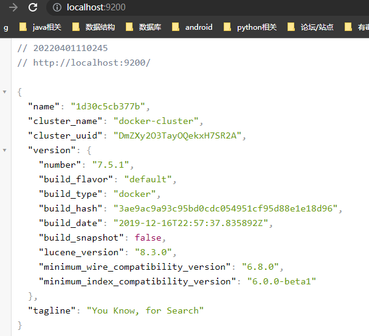

# 基于elk的简易日志系统

## 1. 安装软件环境  elasticsearch/logstash/kibana/构建使用logback的springboot项目

注:本教程基于7.5.1版本elk务必保证elk之间版本一致

### 1.1 安装elasticsearch

1. 安装镜像

   `docker pull docker.elastic.co/elasticsearch/elasticsearch:7.5.1`

2. 单节点模式启动容器

   `docker run -it --name es -d  -p 127.0.0.1:9200:9200 -p 127.0.0.1:9300:9300 -e "discovery.type=single-node" docker.elastic.co/elasticsearch/elasticsearch:7.5.1`

3. 成功后访问 localhost:9200

   

   

### 1.2使用安装logstash

本文基于docker方式安装logstash，其他方式可以参考[官网教程](https://www.elastic.co/guide/en/logstash/7.5/installing-logstash.html)

1. 安装logstash镜像

   `docker pull docker.elastic.co/logstash/logstash:7.5.1`

2. 启动logstash

   `docker run -it --name logstash --link es:es -p 127.0.0.1:4567:4567 -d docker.elastic.co/logstash/logstash:7.5.1`

3. 设置配置文件

   进入容器

   `docker exec -it logstash /bin/bash`

   进入目录

   `/usr/share/logstash/config`

   修改配置文件

   `vi vi logstash.yml`

   将es地址改为

   `xpack.monitoring.elasticsearch.hosts: [ "http://es:9200" ]`

   修改 目录 /usr/share/logstash/pipeline/logstash.conf中配置文件

   ```json
   input {
           tcp {
                   mode => "server"
                   port => 4567
       		   codec => "json"
           }
   }
   filter {
   }
   output {
           elasticsearch {
                   action => "index"
                   hosts => "es:9200"
                   index => "test_log"
           }
   }
   ```

   

4. 退出容器

   `exit`

   后 重启容器

   `docker restart logstash`

### 1.3 安装kibana

1. 下载kibana镜像

   `docker pull docker.elastic.co/kibana/kibana:7.5.1`

2. 启动kibana容器

   `docker run -it --name kibana --link es:es --link logstash:logstash -p 5601:5601 -d docker.elastic.co/kibana/kibana:7.5.1`

3. 修改配置文件

   `docker exec -it kibana /bin/bash`

   将配置文件config/kibana.yml中es地址修改为

   `elasticsearch.hosts: [ "http://es:9200" ]`

4. 重启容器

   `exit`

   `docker restart kibana`

5. 访问localhost:5601

   

### 1.4 springboot整合 logback和logstash


1. pom文件添加

   ```xml
   <dependency>
       <groupId>net.logstash.logback</groupId>
       <artifactId>logstash-logback-encoder</artifactId>
       <version>7.0</version>
   </dependency>
   ```

2. 配置文件中添加

   ```yml
   logging:
     config: src/main/resources/logback-spring.xml
   ```

3. 在相应位置创建文件logback-spring.xml  主要是name=logstash 的appender配置

   ```xml
   <?xml version="1.0" encoding="UTF-8" ?>
   <configuration>
   
   
       <!-- 彩色日志配置 -->
       <!-- 彩色日志依赖的渲染类 -->
       <conversionRule conversionWord="clr" converterClass="org.springframework.boot.logging.logback.ColorConverter" />
       <conversionRule conversionWord="wex" converterClass="org.springframework.boot.logging.logback.WhitespaceThrowableProxyConverter" />
       <conversionRule conversionWord="wEx" converterClass="org.springframework.boot.logging.logback.ExtendedWhitespaceThrowableProxyConverter" />
       <!-- 彩色日志格式 -->
       <property name="CONSOLE_LOG_PATTERN" value="${CONSOLE_LOG_PATTERN:-%clr(%d{yyyy-MM-dd HH:mm:ss.SSS}){green} %clr([${PID:-}]){magenta} %clr([%25.25t]){yellow} %clr([${LOG_LEVEL_PATTERN:-%5p ]}){red} %clr(%-40.40logger{39}){blue} %clr(:){cyan} %m%n${LOG_EXCEPTION_CONVERSION_WORD:-%wEx}}" />
   
       <appender name="consoleLog" class="ch.qos.logback.core.ConsoleAppender">
           <layout class="ch.qos.logback.classic.PatternLayout">
               <pattern>
                   <!--%d{yyyy-MM-dd HH:mm:ss.SSS} [%thread]  %-5level %logger{50} - %msg%n-->
                   ${CONSOLE_LOG_PATTERN}
               </pattern>
           </layout>
       </appender>
   
       <appender name="fileInfoLog" class="ch.qos.logback.core.rolling.RollingFileAppender">
           <filter class="ch.qos.logback.classic.filter.LevelFilter">
               <level>INFO</level>
               <onMatch>DENY</onMatch>
               <onMismatch>ACCEPT</onMismatch>
           </filter>
           <encoder>
               <pattern>
                   %d{yyyy-MM-dd HH:mm:ss.SSS} [%thread]  %-5level %logger{50} - %msg%n
               </pattern>
           </encoder>
           <!--滚动策略-->
           <rollingPolicy class="ch.qos.logback.core.rolling.TimeBasedRollingPolicy">
               <!--路径-->
               <fileNamePattern>D:/data_server/mylog/info_%d.log</fileNamePattern>
           </rollingPolicy>
       </appender>
   
   
       <appender name="fileErrorLog" class="ch.qos.logback.core.rolling.RollingFileAppender">
           <filter class="ch.qos.logback.classic.filter.ThresholdFilter">
               <level>ERROR</level>
           </filter>
           <encoder>
               <pattern>
                   %d{yyyy-MM-dd HH:mm:ss.SSS} [%thread]  %-5level %logger{50} - %msg%n
               </pattern>
           </encoder>
           <!--滚动策略-->
           <rollingPolicy class="ch.qos.logback.core.rolling.TimeBasedRollingPolicy">
               <!--路径-->
               <fileNamePattern>D:/data_server/mylog/error_%d.log</fileNamePattern>
           </rollingPolicy>
       </appender>
   
       <appender name="fileDebugLog" class="ch.qos.logback.core.rolling.RollingFileAppender">
           <filter class="ch.qos.logback.classic.filter.ThresholdFilter">
               <level>DEBUG</level>
           </filter>
           <encoder>
               <pattern>
                   %d{yyyy-MM-dd HH:mm:ss.SSS} [%thread]  %-5level %logger{50} - %msg%n
               </pattern>
           </encoder>
           <!--滚动策略-->
           <rollingPolicy class="ch.qos.logback.core.rolling.TimeBasedRollingPolicy">
               <!--路径-->
               <fileNamePattern>D:/data_server/mylog/debug_%d.log</fileNamePattern>
           </rollingPolicy>
       </appender>
       <appender name="logstash" class="net.logstash.logback.appender.LogstashTcpSocketAppender">
           <destination>127.0.0.1:4567</destination>
           <encoder charset="UTF-8" class="net.logstash.logback.encoder.LogstashEncoder"></encoder>
       </appender>
   
       <root level="INFO">
          <!-- <appender-ref ref="fileInfoLog" />
           <appender-ref ref="fileErrorLog" />
           <appender-ref ref="fileDebugLog" />-->
           <appender-ref ref="consoleLog" />
           <appender-ref ref="logstash" />
       </root>
   </configuration>
   ```

   

### 1.4 测试

运行后可以在kibana中看到相应的日志

.jpg)


## 2. 进阶

进阶中将会实现日志的冷热分离,es账号权限等问题,以满足项目部署中实际需求

### 2.1  es组建集群

创建网络

` docker network create esnet`

启动多个节点

`docker run -v C:\Users\Administrator\Desktop\markdown\config\node1\elasticsearch.yml:/usr/share/elasticsearch/config/elasticsearch.yml -it --name es1  -d -p 127.0.0.1:9201:9200 -p 127.0.0.1:9301:9300  --net esnet docker.elastic.co/elasticsearch/elasticsearch:7.5.1`

`docker network connect esnet es1`

`docker run -v C:\Users\Administrator\Desktop\markdown\config\node2\elasticsearch.yml:/usr/share/elasticsearch/config/elasticsearch.yml -it --name es2  -d -p 127.0.0.1:9202:9200 -p 127.0.0.1:9302:9300  --net esnet docker.elastic.co/elasticsearch/elasticsearch:7.5.1`

`docker network connect esnet es2`

`docker run -v C:\Users\Administrator\Desktop\markdown\config\node3\elasticsearch.yml:/usr/share/elasticsearch/config/elasticsearch.yml -it --name es3  -d -p 127.0.0.1:9203:9200 -p 127.0.0.1:9303:9300  --net esnet docker.elastic.co/elasticsearch/elasticsearch:7.5.1`

`docker network connect esnet es3`


启动 kibana

`docker run -v  :/usr/share/kibana/config/kibana.yml -it --name kibanaToCluster   -p 5601:5601 -d docker.elastic.co/kibana/kibana:7.5.1`

