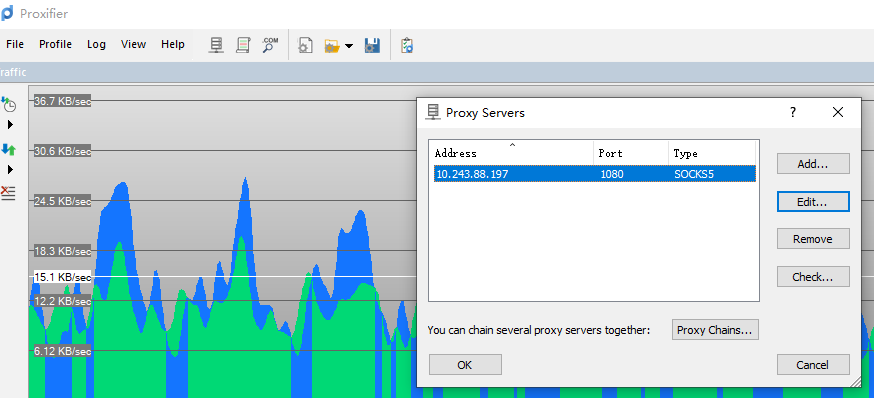

# 基于zerotier的远程办公方案

**问题描述:**

可能是家里网速问题,使用向日葵/teamview/远程桌面时经常卡顿,所以想通过公司电脑做代理的方式,实现在家里电脑上开发的目标

经实测此方案可以基本满足在家开发的需要,但是因为和家用宽带高度相关,可能出现链接卡顿请求超时的问题,是否使用还要看实际情况

### 1. 将公司电脑和家中电脑组建局域网

基于zerotier方案实现组网

1. 从[zerotier](https://www.zerotier.com/)注册并下载应用(服务端/客户端都需要使用这个应用)

2. 注册并登录

3. 在官网的页面上创建一个网络

4. 创建成功后将networkId复制一下

5. 登录本地的zerotier应用并右键 open control panel

   

6. 将network id复制到下面 ############的位置点击 join network

7. 成功后可以在官网看见状态是online的设备,**此时需要手动设置一下设备的局域网ip**,图中ip就是我手动设置的 下面的就是没设置的样子

   

8. 将家里电脑和公司电脑都加入到局域网中  就可以通过设置的ip地址访问了(可以通过这种方式远程桌面到公司电脑,测试效果和向日葵差不多)

### 2. 设置windows代理服务器

windows代理使用了ccproxy [下载地址](https://www.zdfans.com/html/17351.html)

安装即可,设置如下

### 3.客户端设置

客户端使用了 proxifier   [下载地址](https://www.jb51.net/softs/527902.html)

安装后打开 profile->proxy servers

添加地址如下(ip 是服务端ip,端口是socks5端口,协议是socks5)

打开 profile->profication rules

配置如下

192.*开头的使用代理请求,其他直连模式

### 4. 验证

此时可以直接通过本地navicat等工具链接公司的开发环境各种资源

例如 navicat 链接测试数据库(链接速度因人而异)

### 关于git

通过将 公司电脑中ssh秘钥拷贝到本地git中就可以直接将codeup代码同步到本地

秘钥地址为`~/.ssh`

### 关于开发

通过以上方案可以实现在本地启动idea和app的目标,但是因为网络不稳定可以会报一些time out错误,但是会自动重连,造成启动较慢,耐心等待可以启动

